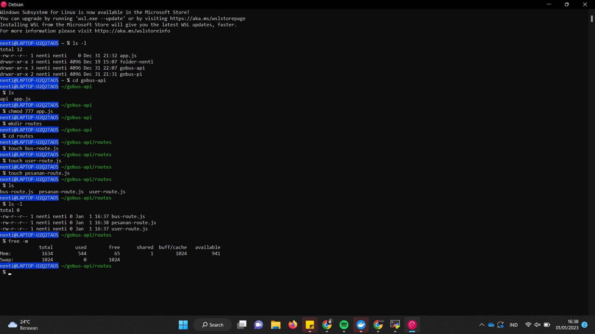
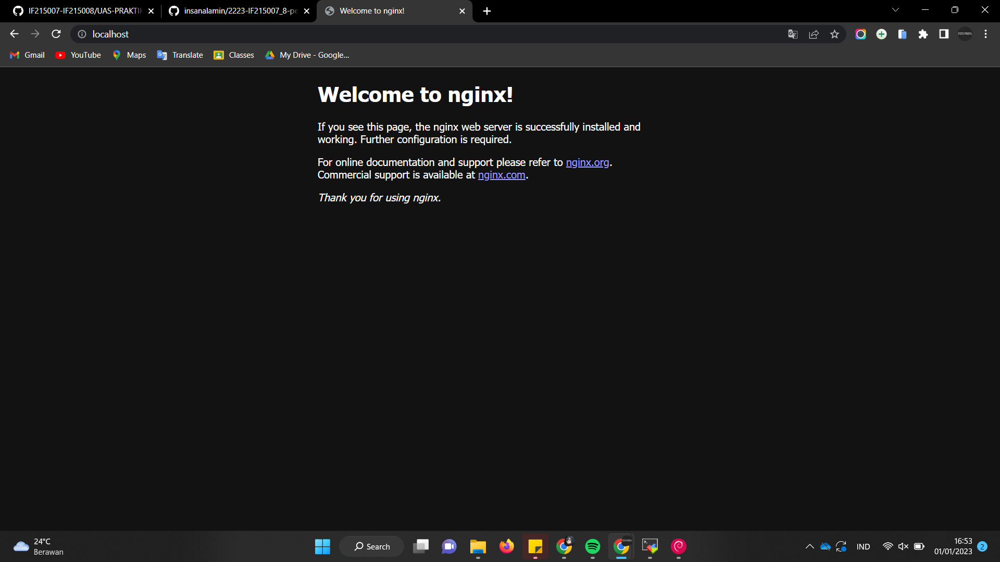
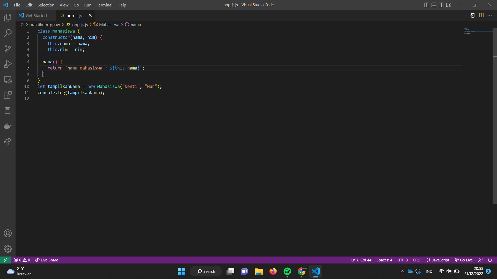
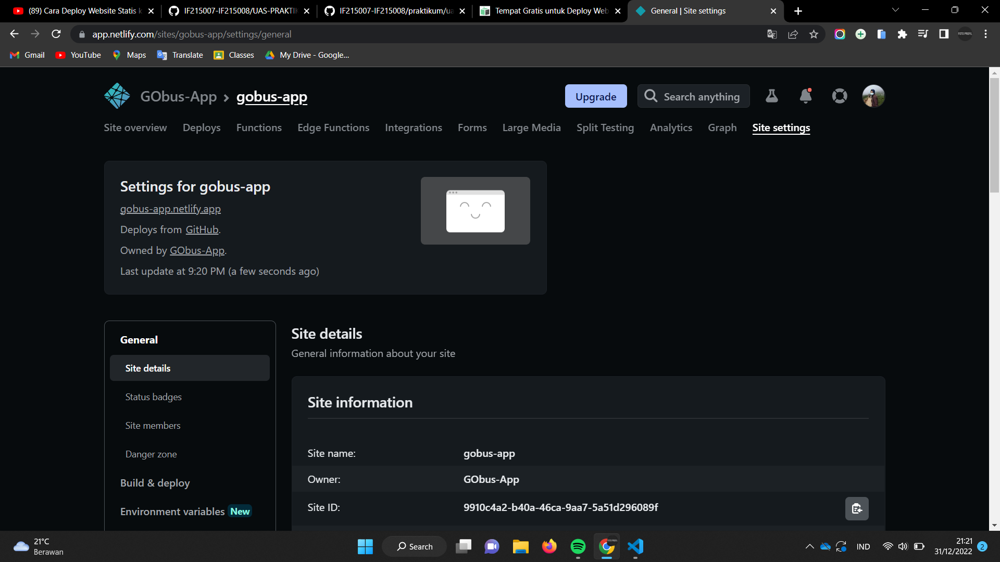

# CLO-0211
### Demo : Git installation

### Demo : Github project initialization

### Demo : Hoppscotch / Postman access

### Demo : PHP & Composer installation & hello world	

### Demo : PostgreSQL / MySQL installation	

### Demo : DBeaver installation & DB connection

### Demo : MobaXterm installation & SSH connection

### Demo : NodeJS & NPM installation, operation & hello world

### Demo : Linux server operation	

### Demo : Nginx / Apache web server installation & operation

### Demo : Cpanel operation	

### Demo : Domain registration

# CLO-0212
### Demo : HTML Responsive Layout with Media Query & Flexbox

### Demo : Javascript Data Transformation

### Demo : Browser API - Event Handling, Local Storage, Element manipulation

### Demo : HTTP GET & POST using Form Action and Fetch API

### Demo : PHP DB - Dynamic Web Page

### Demo : PHP DB - Web Service

### Demo : OOP-based PHP Project using Composer

### Demo : Deploy PHP Project to Cpanel

# CLO-0213
### Demo : HTML Responsive Layout with Bootstrap

### Demo : Single Page App with React & React-router

### Demo : Dynamic Web Page using Laravel

### Demo : Web Service using Slim

### Demo : News Site using Wordpress

