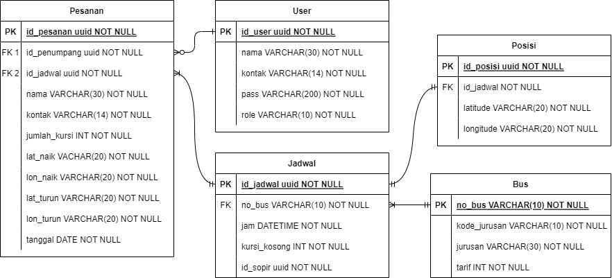

# GObus App
GObus merupakan Aplikasi Booking Tiket Bus Online dan Tracking Bus.

### Permasalahan
Permasalahan yang terkadang saya keluhkan adalah terkait transportasi, tentang ketidakjelasan jadwal keberangkatan bus, meskipun sudah ada jadwalnya tetap saja terkadang ada saja bus yang terlambat berangkat dari terminal ataupun terjebak macet yang membuat saya harus menunggu sampai berjam-jam.

### Rancangan Solusi
Saat menunggu bus yang tak kunjung datang itu saya pun terfikirkan untuk membuat aplikasi tracking bus, agar saya bisa tahu posisi bus, apakah sudah berangkat atau sedang terjebak macet, apakah sudah dekat atau masih jauh, juga pemesanan tiket bus secara online.

### Use Case
- User penumpang dapat melakukan login
- User Penumpang dapat mengubah informasi profil
- User penumpang dapat melilih bus berdasakan jurusan bus
- User penumpang dapat melihat jadwal keberangkatan dan jumlah kursi kosong, dan tarif dari bus yang dituju
- User penumpang dapat melakukan booking tiket bus
- User Penumpang dapat melihat posisi bus yang sudah di booking di maps
- User penumpang dapat menghubungi sopir bus
- User sopir dapat melakukan login
- User sopir dapat mengubah informasi profil dan mengubah informasi bus yang dikendarai
- User sopir dapat melihat posisi terkini
- User sopir dapat melihat daftar penumpang yang sudah membooking tiket di busnya

### Struktur Data

# Source Code
- Frontend : [Frontend GOBUS-app](https://github.com/nentinur/gobus-app)
- Backend : [Backend GOBUS-api](https://github.com/nentinur/gobus-api)

# Demo Project
[Demo Aplikasi - Youtube](https://youtu.be/JgdoCF8vTkQ)
